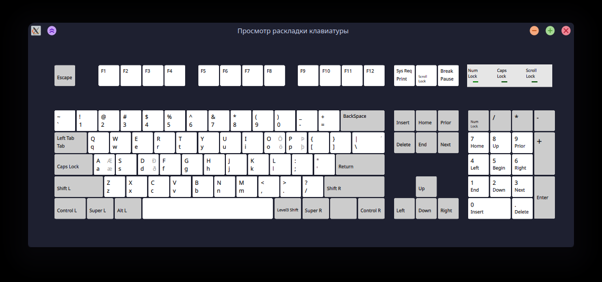

# xkb-us-is-layout
This is a keyboard layout based on the US keyboard, but also allows inputting Icelandic letters. I've made this because coding with the standart layout is infuriating (I can live with " being on shift-a, but why shift parentheses to the left? why move the colon down? and don't even get me started on the square/curly bracket position)

## Mappings

AltGr-A => æ
AltGr-D => ð
AltGr-O => ö ^(screw this letter in particular)
AltGr-/ => ´ dead key, úsé ín cómbínátíón wíth vówéls!
AltGr-P => þ

## Install Instructions
**TODO**: figure out how to add this as a separate keyboard layout
1. Head over to /usr/share/X11/xkb/symbols
2. Copy the contents of the `is` file, and replace the topmost layout (from `default partial alphanumeric_keys` to `};`) with that
3. End your current session (aka log out).
4. The new layout will replace the standart Icelandic layout.
